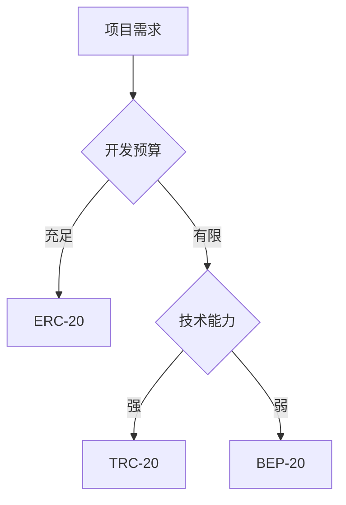

# ERC-20、TRC-20 和 BEP-20 代币标准深度解析

## 一、主流区块链代币标准概览

区块链技术发展至今，已形成多个具有代表性的代币标准。其中以太坊ERC-20、波场TRC-20和币安智能链BEP-20三大标准占据市场主导地位。这些标准化协议不仅规范了代币的创建流程，更构建了区块链生态系统的互通桥梁。

**核心差异对比表：**

| 特性维度       | ERC-20                | TRC-20                | BEP-20                |
|----------------|-----------------------|-----------------------|-----------------------|
| 主网性能       | 高安全性但手续费偏高  | 高TPS低手续费         | 平衡安全与效率        |
| 开发难度       | 中等                  | 低                    | 低                    |
| 跨链兼容性     | 支持多链映射          | 与ETH部分兼容         | 与ETH深度兼容         |
| 生态规模       | 最大（DeFi主导）      | 中等（TRON生态）      | 快速增长（币安生态）  |

👉 [深入了解区块链底层技术原理](https://bit.ly/okx_welcome)

## 二、ERC-20 以太坊代币标准详解

作为首个被广泛采用的智能合约标准，ERC-20（Ethereum Request for Comments 20）定义了代币交互的基本规则。其核心功能包括：

1. **标准化接口**：统一的transfer、approve等函数调用方式
2. **账户模型**：基于EOA（外部账户）和合约账户的双层架构
3. **事件机制**：通过Transfer/Approval事件记录链上交互

**优势分析：**
- 拥有最成熟的DeFi生态（Uniswap、Aave等）
- 智能合约安全性经受多年验证
- 钱包兼容性最佳（MetaMask等主流钱包均支持）

**典型应用场景：**
- 去中心化交易所代币（如UNI）
- 稳定币发行（USDT、USDC的ERC-20版本）
- NFT基础协议标准（部分项目采用）

## 三、TRC-20 波场代币标准技术解析

TRC-20依托TRON虚拟机（TVM）构建，其设计特点包括：

- **账户模型优化**：引入资源模型（带宽/能量）降低手续费
- **兼容性设计**：完全兼容Solidity语法
- **高性能架构**：支持2000+ TPS的交易处理能力

**技术参数对比：**

| 指标         | TRC-20       | ERC-20       |
|--------------|--------------|--------------|
| 平均确认时间 | 3秒          | 15秒         |
| 手续费       | $0.001       | $10-50       |
| 智能合约     | TVM兼容EVM   | 原生EVM      |

👉 [获取波场生态发展白皮书](https://bit.ly/okx_welcome)

## 四、BEP-20 币安智能链标准实践指南

作为BSC（币安智能链）的核心标准，BEP-20在继承ERC-20优势的同时实现创新：

**核心特性：**
- **跨链桥接**：通过BC Bridge实现与币安链（BEP-2）的资产互通
- **Gas机制优化**：采用动态Gas定价模型
- **开发者友好**：兼容Truffle/Hardhat等主流开发工具

**生态发展现状：**
- 日均交易量突破1500万笔
- 覆盖DEX、借贷、NFT等12个应用场景
- 支持跨链资产规模超$300亿

## 五、代币标准选择决策模型

选择适合的代币标准需要综合评估以下维度：

1. **项目定位**：金融类项目优先考虑ERC-20，高频交易场景适合TRC-20
2. **成本预算**：初期项目可选择TRC-20/BEP-20降低部署成本
3. **生态需求**：跨链需求强烈的项目建议采用BEP-20
4. **技术储备**：团队技术实力决定是否采用复杂标准

**选择决策树：**

## 六、FAQ常见问题解答

**Q1：如何验证代币是否符合标准？**
A：可通过区块链浏览器查看代币合约是否实现标准接口函数，ERC-20需包含6个必选函数和3个可选事件。

**Q2：不同标准代币能否互通？**
A：通过跨链桥协议可实现互通，但需注意滑点和手续费成本。BEP-20与ERC-20的跨链成本通常低于$1。

**Q3：哪种标准更适合发行稳定币？**
A：综合考虑生态支持度和用户基础，ERC-20仍是主流选择，但TRC-20在东南亚市场增长迅速。

**Q4：如何选择钱包进行代币管理？**
A：建议使用支持多链的钱包（如TokenPocket），注意区分主网配置避免资产损失。

**Q5：标准升级会带来哪些影响？**
A：重大升级可能引发兼容性问题，需提前进行合约审计，建议预留至少3个月过渡期。

## 七、区块链代币标准发展趋势

1. **模块化演进**：EIP-4337等提案推动账户抽象化
2. **跨链标准化**：CCIP等协议构建通用跨链标准
3. **隐私增强**：零知识证明技术融入代币标准
4. **监管合规**：STO（证券型代币）标准逐步完善

👉 [获取最新区块链技术趋势报告](https://bit.ly/okx_welcome)

## 八、代币发行实施路径

1. **需求分析**：明确代币经济学模型和应用场景
2. **标准选择**：根据决策模型确定技术方案
3. **智能合约开发**：建议采用OpenZeppelin等成熟框架
4. **安全审计**：至少选择2家独立审计机构
5. **多链部署**：通过官方桥实现跨链资产映射

**典型部署流程图：**

## 九、行业最佳实践案例

**案例1：USDT多链部署策略**
- 主网：Omni（原始发行）
- 扩展：ERC-20（DeFi生态）、TRC-20（低手续费）、BEP-20（币安生态）
- 成果：实现超过98%的交易所接入覆盖率

**案例2：新型DeFi项目代币设计**
- 采用BEP-20标准
- 集成自动做市商（AMM）机制
- 通过跨链桥实现多链流动性聚合
- 上线3个月TVL突破$5亿

## 十、技术演进路线图

| 时间节点 | 关键技术突破               | 行业影响                     |
|----------|----------------------------|------------------------------|
| 2023Q4   | EIP-4844分片技术实施       | 显著降低Gas费用              |
| 2024Q2   | ZK-Rollups大规模商用       | TPS提升至10万+               |
| 2025Q1   | 多链身份认证协议落地       | 实现跨链资产可组合性         |
| 2026Q3   | 量子抗性加密算法标准化     | 提升长期资产安全性           |

通过系统化的标准选择和技术规划，区块链项目方可以更高效地构建数字资产生态。建议在启动前进行充分的技术可行性研究，并持续关注行业标准演进动态。