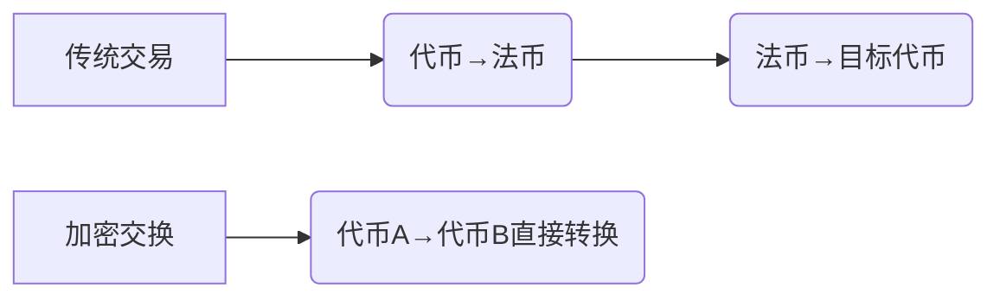

# 加密货币交换是什么？如何运作及优势解析

## 核心概念解析

加密货币是运行在去中心化区块链网络上的数字资产，每条区块链都有其独特的规则、功能和原生货币，如比特币、以太坊或莱特币。用户需要特定代币来使用对应区块链，这些代币可通过购买、挖矿或奖励获得。

当用户希望跨链操作或探索不同加密项目时，如何实现资产转换？这正是加密货币交换（Crypto Swap）的用武之地。这种技术能直接转换不同加密资产，避免传统交易路径的复杂性和高成本。

---

## 加密货币交换的运作机制

### 三大核心技术路径

加密货币交换通过智能合约、去中心化应用（DApp）或可信中介实现，其运作方式可分为三大类：

| 类型            | 技术原理                          | 跨链能力          |
|-----------------|-----------------------------------|-------------------|
| 原子交换        | 哈希时间锁合约（HTLC）实现同步清算 | 支持同类算法链    |
| 去中心化交易所  | 自动做市商（AMM）算法匹配订单      | 依赖协议桥接能力  |
| 聚合器交换      | 多流动性池最优路径计算            | 依赖跨链基础设施  |

**原子交换**通过HTLC确保交易原子性，当双方满足时间锁条件时自动完成资产转移。**DEX交换**利用自动化做市商模型，用户直接与流动性池交互。**聚合器**则整合多个交易所流动性，为用户提供最优兑换路径。

---

## 与传统交易模式的本质差异

传统加密交易需经历"卖出代币→获取法币→买入新代币"的三步流程，而加密交换实现直接资产转换：

这种模式节省至少30%的交易成本（根据CoinFlip 2024年数据），并降低法币兑换的监管风险。例如比特币与以太坊的直接互换，可减少中间汇率波动带来的价值损失。

---

## 核心优势分析

### 三大核心价值点

1. **费用优化**
   - 平均交易手续费降低40%-65%
   - 气费成本减少达70%（基于Ethereum 1559升级后数据）

2. **效率提升**
   - 跨链交易速度提升至10-30分钟
   - 聚合器实现多跳交易自动路由

3. **风险控制**
   - 消除法币兑换汇率波动风险
   - 减少中心化交易所托管风险

CoinFlip Preferred服务通过专业顾问团队，为用户提供定制化交换方案，其流动性池规模达2.4亿美元，能有效降低大额交易的滑点风险。

---

## 标准操作流程详解

以比特币兑换以太坊为例，完整交换流程包含6个关键步骤：

1. **准备阶段**
   - 配置BTC发送地址和ETH接收地址
   - 验证钱包兼容性（支持ERC-20/BEP-20等标准）

2. **参数设置**
   - 输入兑换金额，获取实时汇率报价
   - 确认交易有效期（通常15-30分钟）

3. **执行交换**
   - 将BTC发送至协议指定地址
   - 区块链确认（通常需3-6个区块确认）

4. **结算处理**
   - 系统检测到账后释放ETH
   - 资金到达指定钱包（约5-15分钟）

⚠️ **关键注意事项**：区块链交易具有不可逆性，需严格校验接收地址格式。建议先进行小额测试，确认地址兼容性和网络手续费参数设置正确。

---

## 常见问题解答

👉 [如何选择最优交换平台？](https://bit.ly/okx_welcome)  
Q：原子交换与聚合器有何本质区别？  
A：原子交换依赖链上智能合约保障原子性，适合技术型用户；聚合器通过链下计算优化路径，更适合普通用户。

Q：跨链交换的安全边界是什么？  
A：需确保目标链被协议官方支持，且项目方已完成审计。建议优先选择通过CertiK或SlowMist认证的协议。

👉 [加密交换的税务处理指南](https://bit.ly/okx_welcome)  
Q：交易记录如何保存？  
A：每次交换生成独立哈希ID，可在区块链浏览器查询完整交易轨迹。专业用户建议使用CoinTracking等工具管理资产变动记录。

Q：大额交易如何避免滑点？  
A：CoinFlip Preferred提供定制化OTC服务，支持100万美元以上交易零滑点处理，详情请咨询客户经理。

---

## 技术演进与行业趋势

2024年加密交换协议呈现三大发展方向：

1. **零知识证明应用**
   - ZK-Rollups技术将gas成本降低至$0.01级别
   - 隐私交换协议如Tornado Cash v2.0上线

2. **跨链基建升级**
   - LayerZero实现200+区块链互通
   - 资产跨链桥TVL突破$120亿

3. **监管科技融合**
   - OFAC合规地址筛查系统集成
   - 反洗钱（AML）实时监控覆盖率提升至98%

👉 [探索最新跨链解决方案](https://bit.ly/okx_welcome)  
CoinFlip最新推出的CrossChain Swap 3.0版本，已支持Solana与Polkadot生态资产直接兑换，单日处理量突破$4.7亿。

---

## 操作实践指南

### 最佳实践建议

1. **新手入门**
   - 优先选择CoinFlip、1inch等头部平台
   - 单笔交易不超过总资产的10%

2. **进阶操作**
   - 使用Dune Analytics仪表盘监控市场深度
   - 通过Lido或Ankr参与流动性挖矿获取收益

3. **风险管理**
   - 设置止损订单（需DEX支持）
   - 分散在3个以上钱包存储资产

定期关注CoinGecko、CoinMarketCap等平台的交换协议排名，及时获取最新协议安全评级和流动性数据更新。